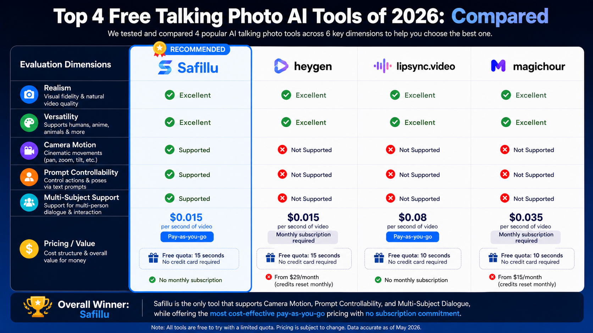

# 2026 Best "Talking Photo" AI Tools Deep Review

Published on 2026-05-04 by the Safiindeed Technical Team

**The Ultimate Ranking After Splurging $2,000:** 2026 is officially the "watershed year" for AI video generation. The days of being satisfied with "just making it move" are over. Users now demand cinematic performance.

To help you find the ultimate creative weapon in a saturated market, our team spent the last week conducting a "hell-level" audit. We initially scouted 30+ AI projects, and frankly, the results were depressing. Most tools are still stuck in "second-tier" territory: flickering frames, lip-sync misalignment, and the dreaded "Uncanny Valley", where only the mouth moves while the body remains frozen like a mannequin. For commercial use, that's a death sentence.

We narrowed it down to the top 4 heavy hitters for a deep dive. Over 7 days, we generated 1,000 videos and burned through $2,000 in testing costs. Here is the definitive report based on 6 professional dimensions.

## I. The 6 Dimensions of Evaluation

To keep things fair, we scored each tool on:

### 1. Realism: Facial expressions and natural body micro-movements
[https://github.com/user-attachments/assets/5024c9b4-1ea3-4f2a-b54d-4fef0b5f6cb2]
https://github.com/aivideolearn/Awesome-AI-Video-Review/raw/main/public/videos/video1.mp4
<video src="https://github.com/aivideolearn/Awesome-AI-Video-Review/raw/main/public/videos/video1.mp4" width="100%" controls></video>
[Watch the realism demo video](./public/videos/video1.mp4)

### 2. Versatility: Support for anime, oil paintings, and animal characters

[Watch the animal and anime character demo video 1](./public/videos/video2.mp4)

[Watch the animal and anime character demo video 2](./public/videos/video3.mp4)

### 3. Camera Motion: Support for cinematic pans, zooms, and tilts

### 4. Prompt Controllability: Precision in controlling specific actions via text

[Watch the camera motion and prompt controllability demo video](./public/videos/video5.mp4)

### 5. Multi-Subject Support: Handling dialogues and interactions between two or more people

[Watch the multi-subject AI talking photo demo video](./public/videos/video6.mp4)

### 6. Pricing/Value: Cost per second and flexibility of the payment model

## II. The "Pro" Divide: Why These 3 Features Matter

In our 1,000-video stress test, these three features separated the "toys" from the "productivity tools":

- **Virtual Camera Motion:** This is the soul of "cinematic feel." It breaks the cheap look of a fixed camera.
- **Prompt Controllability:** This means you aren't just gambling on "luck-based generation". You are the director.
- **Multi-Subject Support:** The high bar for 2026. This allows you to turn a single group photo into a scripted drama, exploding your social media reach.

## III. The Ultimate Ranking: Top 4 AI Talking Photo Tools

## Rank 1: Safillu, The Undisputed King

[Safillu](https://ai.safillu.com/en/app/pictureToVideo/index) is the best overall talking photo AI tool in this test, with the strongest balance of performance, creative control, and cost.

**The Lowdown:** As the flagship tool of Safiindeed, Safillu dominated our tests. It's the only tool that perfectly balances high-end features with insane accessibility.

- **Pros:** The only one to nail Camera Motion, Prompt Control, and Multi-Subject Dialogue simultaneously.
- **Incredible Value:** Costs as low as $0.015/sec.
- **Flexibility:** Uses a pay-as-you-go model with no mandatory monthly subscription.
- **Cons:** High traffic means occasional generation failures or rare "static mouth" glitches.

[Claim Your 15s Free Trial](https://ai.safillu.com/en/app/pictureToVideo/index)

## Rank 2: HeyGen

[HeyGen](https://app.heygen.com) is a reliable premium choice for realistic talking head videos.

**The Lowdown:** Excellent realism and skin textures. It's fast and polished.

- **Pros:** High-end visual fidelity and industry-leading generation speed.
- **Cons:** Currently lacks camera motion, action control, and multi-subject support.
- **Pricing:** Matches Safillu's price at $0.015/sec, but forces a $29/month minimum subscription, which is a heavy lift for casual creators.

[Claim Your 15s Free Trial](https://app.heygen.com)

## Rank 3: Magic Hour

[Magic Hour](https://magichour.ai) is a strong option for stylized talking photo content.

**The Lowdown:** If you are working with stylized content like anime, furries, or oil paintings, this is your best bet.

- **Pros:** Top-tier versatility for non-human characters.
- **Cons:** No camera motion, complex action control, or multi-subject support.
- **Pricing:** More expensive at $0.035/sec with a $15/month subscription barrier.

[Claim Your 15s Free Trial](https://magichour.ai)

## Rank 4: Lipsync.video

[Lipsync.video](https://lipsync.video/ai-talking-photo-generator) is a vertical specialist for realistic human talking heads.

**The Lowdown:** Great for realistic human talking heads, but very limited beyond that single workflow.

- **Pros:** High realism for standard influencer-style videos.
- **Cons:** Extremely limited functionality; no camera movement or multi-person interaction.
- **Pricing:** The most expensive in our test at $0.08/sec. While it supports pay-as-you-go, the price-to-performance ratio is weak.

[Claim Your 15s Free Trial](https://lipsync.video/ai-talking-photo-generator)

## IV. Commercial Insight: Subscription vs. Pay-As-You-Go

By 2026, "subscription fatigue" is real. Subscription models like HeyGen and Magic Hour are best for large agencies with massive daily output. Pay-as-you-go tools like Safillu and Lipsync.video are the preferred choice for freelancers and startups.

**Pay-as-you-go stands out here** by removing the subscription gate and keeping the unit price low, making it easier for creators to spend only when they generate usable output.

## Final Thoughts

If 2025 was the "playtime era" for AI video, 2026 is the Era of Industrialized Content. The winners won't be those who can simply "make a video," but those who can produce high-quality, high-control, and high-engagement content at the lowest possible cost.

For creators searching for the best AI talking photo tool in 2026, Safillu is the strongest all-around choice in this review because it combines camera motion, prompt controllability, multi-subject support, and low pay-as-you-go pricing.
